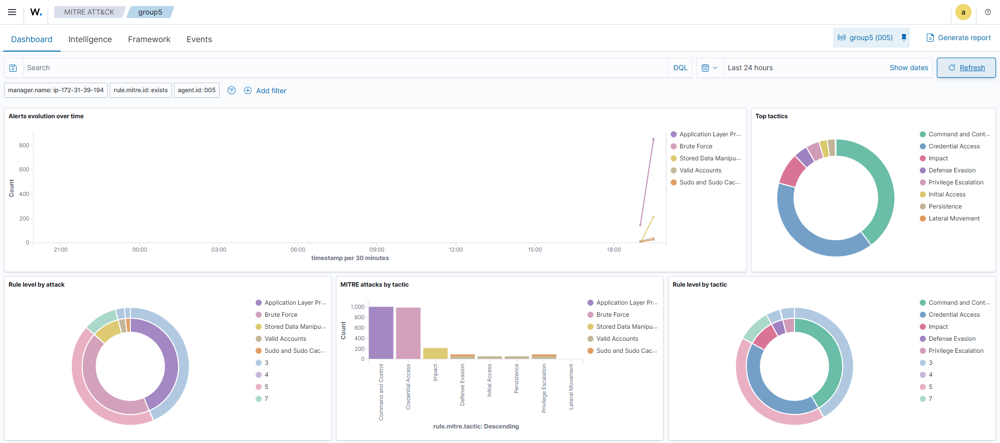

# Project: Container Security & Threat Detection (Docker + Wazuh)

## 🎯 Objective
To implement a "Blue Team" monitoring strategy for modern, containerized applications. This project involved deploying a **Flask** web application inside a **Docker** container and configuring **Wazuh** to detect application-layer attacks and unauthorized access attempts.

## 🛠️ Technology Stack
* **Orchestration:** Docker Engine
* **Application:** Python Flask Web App ("Mercury Project")
* **Security Monitoring:** Wazuh Agent (Docker Listener & Syscollector)
* **Attack Tools:** Hydra (Brute Force), Nmap

## 🏗️ Security Architecture

### 1. Container Monitoring Strategy
Traditional endpoint agents often fail to see inside containers. To bridge this gap, I configured the **Wazuh Docker Listener**:
* **Syscollector:** Enabled the system inventory module to track changes to the container's immutable infrastructure (packages, OS version).
* **Log Collection:** Configured Wazuh to ingest standard output (stdout) from the Flask application to detect suspicious web requests.

### 2. The Target Environment
* Hosted a lightweight Python Flask application serving a web interface.
* Isolated the container on a custom Docker network to simulate a microservices segment.

## 🛡️ Attack Simulation & Detection

To validate the monitoring configuration, I executed a **"Red Team"** simulation against the containerized host.

### Scenario: SSH Brute Force
* **The Attack:** Executed a dictionary attack against the host's SSH service to simulate a credential harvesting attempt.
* **The Detection:** Wazuh's Analysis Engine correlated multiple failed authentication events within a short time window.
* **The Alert:** Triggered **Rule ID 5712** (SSHD authentication failed) and visualized the spike in login attempts on the dashboard.

> **[Attack Visualization Here]**
> **
> *(Figure: Wazuh dashboard highlighting the spike in failed authentication attempts during the simulation).*

## 🚀 Key Takeaways
* **Visibility is Key:** Learned that securing containers requires a different approach than securing virtual machines—specifically needing access to the Docker socket.
* **Behavioral Analysis:** Validated that high-volume log anomalies (like 500+ login attempts) are the fastest way to identify automated attacks.
* **Blue Team Workflow:** Practiced the full lifecycle of **Identify (Config) $\rightarrow$ Detect (Attack) $\rightarrow$ Analyze (Logs)**.
