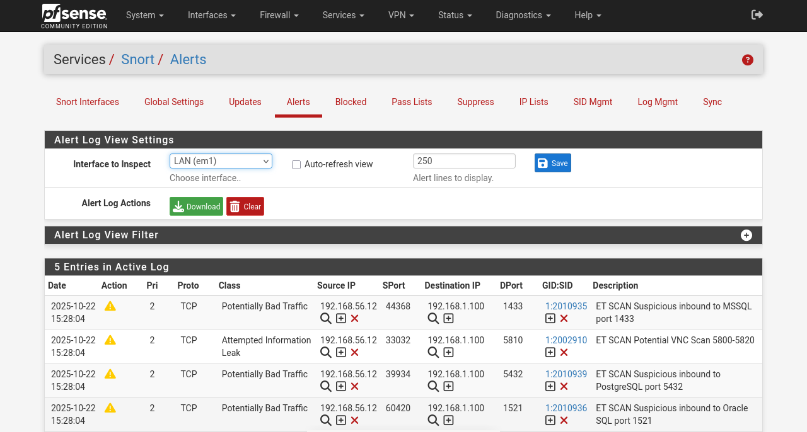

# Project: Network Defense Engineering (pfSense + Snort IDS)

## 🎯 Objective
To design and deploy a secure network perimeter using **pfSense** as a stateful firewall and **Snort** as an Intrusion Detection System (IDS). This project focuses on network segmentation, rule-based traffic filtering, and signature-based threat detection.

## 🛠️ Technology Stack
* **Firewall OS:** pfSense Community Edition
* **IDS Engine:** Snort (Package v4.x)
* **Rule Sets:** Emerging Threats (ET) Open Rules, Snort Community Rules
* **Network Topology:** Dual-Interface Gateway (WAN/LAN) protecting a Debian victim machine.

## 🏗️ Implementation Details

### 1. Perimeter Configuration (Firewall)
I deployed pfSense as the primary gateway to manage traffic flowing between the external "untrusted" network and the internal "secure" subnet (192.168.1.0/24).
* **Interfaces:** Configured **WAN** (Bridged) for upstream connectivity and **LAN** (Static) for internal host management.
* **NAT/Routing:** Established Outbound NAT rules to allow internal hosts to access the internet while remaining masked behind the gateway IP.

### 2. Intrusion Detection System (IDS)
I integrated the **Snort** package directly onto the firewall to perform Deep Packet Inspection (DPI) on ingress traffic.
* **Rule Selection:** Enabled the **ET Open** (Emerging Threats) ruleset to detect known scanning patterns and exploit signatures.
* **Preprocessor Config:** Tuned the HTTP and SSH preprocessors to identify anomalies before they reached the internal servers.

## 🛡️ Attack Simulation & Results

To validate the defense stack, I launched a comprehensive service enumeration scan (Nmap) against the firewall's external IP.

### The Detection Logic
Snort successfully identified the scanning behavior by matching the traffic against known signatures in the **ET SCAN** category.

**Captured Alerts:**
* **ET SCAN Suspicious inbound to MSSQL** (Port 1433)
* **ET SCAN Potential VNC Scan** (Port 5800-5900)
* **ET SCAN Suspicious inbound to PostgreSQL** (Port 5432)

> **
> *(Figure: Snort "Alerts" tab identifying Nmap service probes targeting database and remote access ports).*

## 🚀 Key Takeaways
* **Signature Management:** Learned how to download, enable, and tune IDS rule sets (VRT/ET) to reduce false positives.
* **Integrated Security:** Understood the architectural advantage of running IDS directly on the gateway (blocking threats *before* they enter the LAN).
* **Log Analysis:** Gained proficiency in interpreting IDS alert data (Source IP, Destination Port, Rule SID) to classify the type of attack.
