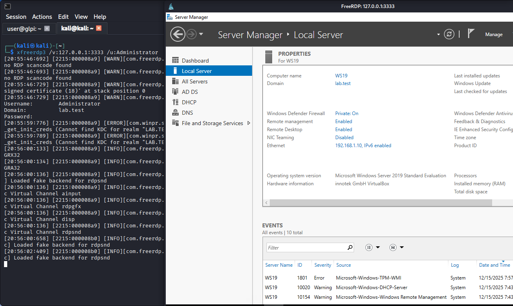

# Project: Offensive Security, Reconnaissance & Lateral Movement

## 🎯 Objective
To evaluate the resilience of network security controls by simulating advanced adversary reconnaissance and lateral movement techniques. This project focuses on utilizing **Nmap** for stealthy discovery and **SSH Tunneling** to bypass firewall restrictions and pivot into protected internal network segments.

## 🛠️ Technology Stack
* **Attacker OS:** Kali Linux 2025.2
* **Target Environment:** pfSense-protected subnet (DMZ & LAN zones)
* **Tools:** Nmap, Wireshark, SSH, xfreerdp

## 🏗️ Technical Implementation

### 1. Stealth Reconnaissance & Evasion
I utilized specialized **Nmap** techniques to map the target surface while attempting to circumvent stateful packet inspection:
* **Packet Fragmentation (`-f`):** Split TCP headers across multiple small packets to bypass simple signature-based filtering.
* **Decoy Scanning (`-D RND:10`):** Generated random "decoy" IP addresses to mask the true origin of the scan within security logs.
* **SYN Stealth Scan (`-sS`):** Performed "half-open" scanning against the DMZ host (`192.168.3.100`) to identify open services like **SSH (22)** and **HTTP (80)**.

### 2. Service Enumeration
I performed deep fingerprinting to identify the exact software versions running on the discovered ports:
* **Version Detection (`-sV`):** Identified **OpenSSH 10.0p2** and **Apache 2.4.65** on the target.
* **Banner Grabbing:** Used Nmap scripts to confirm service details and protocol versions in preparation for the exploitation phase.

## 🛡️ Lateral Movement: The Successful Pivot

The core of this simulation involved bypassing a firewall "deny-all" policy between the external network and the internal LAN.

### Scenario: SSH Local Port Forwarding
* **The Problem:** Direct access to the internal Windows Server (`192.168.1.10`) was blocked by pfSense.
* **The Solution:** Leveraging a "pinhole" misconfiguration that allowed RDP traffic from the DMZ to the LAN, I established an SSH tunnel.
* **The Command:** `ssh -L 3333:192.168.1.10:3389 user@192.168.3.100`.

> 
> *(Figure: A successful RDP session to internal host 192.168.1.10 initiated from Kali Linux through an encrypted SSH tunnel).*

## 🚀 Key Takeaways
* **Pivoting Logic:** Gained practical experience in "living off the land" by using authorized services (SSH) to access unauthorized segments.
* **Defensive Insight:** This exercise demonstrated why "pinhole" firewall rules are a high risk and must be strictly monitored by a SOC analyst.
* **Tool Mastery:** Developed proficiency in using **xfreerdp** and **netstat** to verify tunnel integrity before launching an attack.
