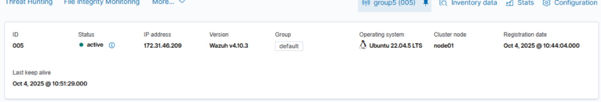

# Project: Enterprise SIEM Deployment (Wazuh)

## 🎯 Objective
To deploy and configure a centralized **Security Information and Event Management (SIEM)** and **Extended Detection and Response (XDR)** platform using Wazuh. This project establishes the "Central Nervous System" for security monitoring, enabling real-time log ingestion, threat detection, and compliance auditing.

## 🛠️ Technology Stack
* **Platform:** Wazuh 4.x (Open Source SIEM/XDR)
* **Deployment Method:** Pre-built OVA (Open Virtual Appliance)
* **Hypervisor:** Oracle VM VirtualBox
* **Networking:** NAT Network (Internal Lab Network)

## 🏗️ Infrastructure Architecture

### 1. The Wazuh Stack
I deployed the **Wazuh All-in-One** architecture, which consolidates the following components onto a single virtual appliance for streamlined management:
* **Wazuh Indexer:** A highly scalable, full-text search and analytics engine (based on OpenSearch) for indexing security alerts.
* **Wazuh Server:** The management node that analyzes data received from agents, triggers rules, and manages the API.
* **Wazuh Dashboard:** The web-based user interface for data visualization and threat hunting.

### 2. Network Configuration
To ensure a secure and isolated environment for testing malware and attacks, I configured a dedicated **NAT Network** in VirtualBox.
* **Isolation:** Verified that the SIEM and all subsequent agents (Windows/Linux) reside on the same private subnet.
* **Connectivity:** Configured port forwarding rules to allow access to the Wazuh Dashboard (Port 443) from the host machine for management.

## ⚙️ Configuration & Hardening

### Deployment Steps
1.  **OVA Import:** Imported the official Wazuh OVA into VirtualBox to ensure a standardized, production-ready OS baseline.
2.  **Resource Allocation:** Provisioned 4GB RAM and 2 vCPUs to handle the log ingestion load from multiple agents.
3.  **Agent Enrollment:** Verified the integrity of the enrollment service (Port 1515) to allow seamless connection of future endpoints.

### Dashboard Verification
*Successfully accessed the Wazuh web interface and confirmed the "Health Check" status of all core services (Indexer, Manager, API).*

> **[Dashboard Screenshot Here]**
> **
> *(Note: This confirms the active status of the SIEM manager).*

## 🚀 Key Takeaways
* **Infrastructure as Code:** Gained experience deploying complex security stacks using virtual appliances.
* **Network Segmentation:** Understood the importance of placing security management tools on restricted, monitored subnets.
* **Log Pipeline:** Learned the flow of data from Endpoint $\rightarrow$ Manager $\rightarrow$ Indexer $\rightarrow$ Dashboard.
